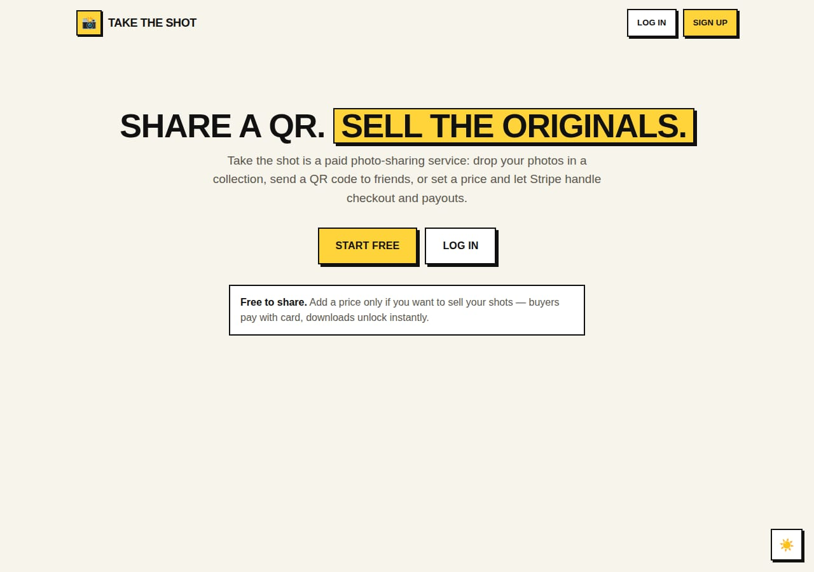
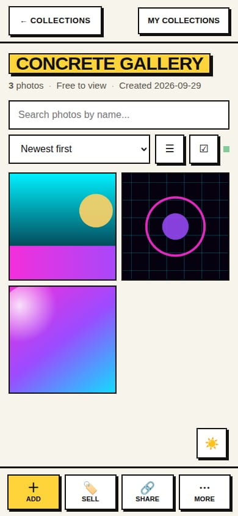
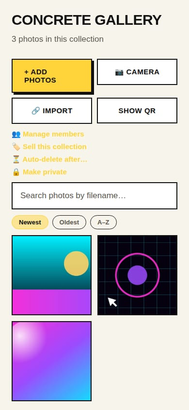
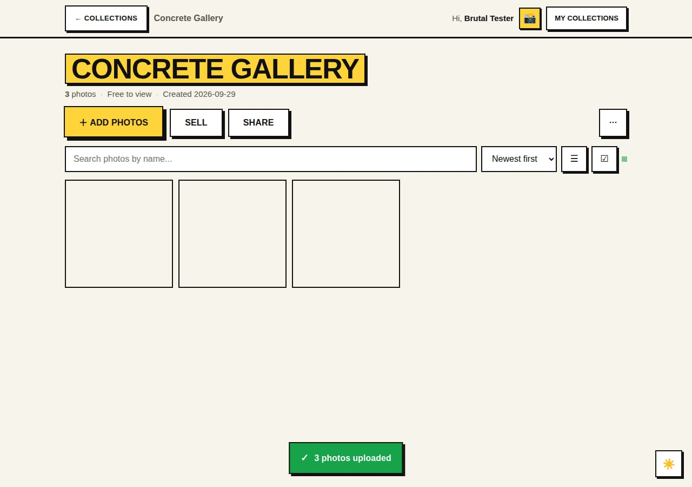

# Take the shot

A **simple, private alternative to subscription photo galleries**. Create a
collection, share it with a QR code or link, and put a price on it if you want —
buyers pay by card with Stripe and the originals unlock instantly.

Run it yourself and nothing leaves your server: no analytics, no tracking, no ads,
no third-party scripts, no monthly plan. Photos live in your private storage and
you decide when they expire.

- **Simple** — three steps: name a collection, add photos, share the QR code
- **Private** — self-hosted, private storage, auto-delete, no trackers
- **Paid** — sell the original files with Stripe; no subscription, no commission
- **Web + mobile** — installable PWA, plus an optional Expo app

**New here? [Getting started](docs/GETTING_STARTED.md)** walks through creating an
account, uploading from your phone, and getting paid.

## What it does

| Feature | Notes |
| --- | --- |
| Collections + QR sharing | Scan the QR and the gallery opens, no app install needed |
| **Sell your shots** | Set a price per collection; buyers pay with Stripe Checkout |
| **Time-limited hosting** | Auto-delete a collection after 1–3650 days; hourly sweeper + cron endpoint |
| Free or paid | `price_cents` empty = free; thumbnails stay visible either way |
| Locked originals | Paid collections stream low-res thumbnails until purchased |
| Sales dashboard | Owners see sales count, revenue and buyer emails per collection |
| Thumbnails | `sharp` generates 640px JPEG thumbs and reads width/height |
| Search, sort, filter, grid/list | Persistent per-browser preferences |
| Multi-select | Click-drag marquee, right-click drag, shift-click ranges, context menu |
| Batch actions | Download selected as ZIP, delete selected in one request |
| Import from links | Google Drive file links, direct image URLs, any page with `og:image` |
| Camera QR import | Scan a camera's QR for copyable Wi-Fi details + transfer steps, or a linked photo |
| Collaboration | Invite viewers/editors by email; private collections stay member-only |
| Live sync | New photos appear for everyone within ~5s |
| ZIP download | Whole collection or a selection |
| Save a shared collection | Copies photos into your own account |
| Accounts | Sessions, bcrypt hashes, rate limits, session TTL |
| Responsive + mobile UI | Bottom action bar, bottom-sheet modals, safe-area padding, dark/light theme |
| Installable PWA | Add to Home Screen on Android/iOS/desktop, offline page, no app store |
| Mobile uploads | Camera or library picker, on-device downscale, per-file progress |

## Why Take the shot

A quick, honest comparison with the alternatives people usually use.

| | Take the shot | Subscription galleries | QR event apps |
| --- | --- | --- | --- |
| Where photos live | **Your server, your private bucket** | Their cloud | Their cloud |
| Monthly plan | **None** | $8-50/month | None |
| Cost per sale | **0%** (your own Stripe) | 0-15% commission | per-event fee, usually $19-49 |
| Sell original files | **Yes, built in** | Yes, print-first | Rarely |
| Account needed to view or buy | **No** | No | No |
| Analytics, ads, tracking | **None** | Varies | Varies |
| Auto-delete hosting | **1-3650 days, your choice** | Rarely | 30-90 days |
| Face / selfie search | Not yet ([#1](https://github.com/Jayhub27/photo-sharing-app/issues/1)) | Some | Some |
| Print fulfillment | No | Yes | No |
| Video | No | Yes | Some |

If you need print labs, video delivery or face search today, ShootProof,
Pixieset or Pic-Time are genuinely better products for that. Take the shot is for
the simpler job: hand people a link, let them buy the originals, keep the photos
on your own infrastructure.

## Privacy

- **No analytics, no tracking pixels, no ads, no third-party scripts.** CSS, JS
  and the PWA assets are served from your own origin — including fonts, so a
  gallery load does not leak visitors to anyone.
- **Private storage.** The bucket is never public; every image byte is streamed
  through an authenticated endpoint after an access check on the collection.
- **Buyers don't need accounts.** Their email is only passed to Stripe for the
  receipt.
- **Expiring by design.** Auto-delete removes storage objects, photo rows,
  members and purchase records within an hour of the deadline.
- **Small data footprint.** Accounts (name, email, bcrypt hash), photos and
  metadata, sessions, membership, purchases. Nothing else.
- **No lock-in.** Every original can be downloaded as a ZIP; the schema is plain
  Postgres and the storage is a standard Supabase bucket.

## Screenshots

| Web | Mobile web | Expo app |
| --- | --- | --- |
|  |  |  |
|  |  | |

## Architecture

```
┌─────────────────┐  HTTP   ┌──────────────────┐          ┌──────────────────┐
│  Web (server    │ ──────▶ │  Express API     │ ───────▶ │  Supabase        │
│  rendered pages)│ ◀────── │  + sharp + Stripe│ ◀─────── │  Postgres/Storage│
└─────────────────┘         └────────┬─────────┘          └──────────────────┘
┌─────────────────┐                  │ Stripe Checkout / webhooks
│  Expo mobile app│ ─────────────────┘
└─────────────────┘
```

```
photo-sharing-app/
├─ server/                 Express + TypeScript API and web pages
│  ├─ src/
│  │  ├─ index.ts          App entry, security headers, CORS, static PWA assets
│  │  ├─ routes.ts         Collections, photos, QR, members, import, selling
│  │  ├─ stripe.ts         Stripe client + schema/feature detection
│  │  ├─ auth.ts           Signup/login/sessions
│  │  ├─ theme.ts          Shared CSS (brutalist-flat theme, dark + light)
│  │  ├─ ui.ts             Layout, PWA plumbing, theme/install helpers
│  │  ├─ page-home.ts      Collection list page
│  │  ├─ page-collection.ts Collection page (selection, selling, import, upload)
│  │  ├─ page-auth.ts      Login/signup pages
│  │  ├─ ratelimit.ts      Fixed-window limiter
│  │  └─ zip.ts            ZIP writer
│  ├─ public/              PWA manifest, service worker, icons, offline page
│  └─ scripts/             Icon generator (sharp)
├─ app/                    Expo / React Native mobile app
├─ supabase/schema.sql     Full database schema (run in the Supabase SQL editor)
└─ supabase/migrations/    Incremental migrations (selling)
```

## Setup

### 1. Database

Create a Supabase project, then run **all of `supabase/schema.sql`** in the SQL
editor. It creates the tables, indexes, RLS hardening and the storage setup.

> Selling needs the `selling` section at the bottom of that file
> (`price_cents`, `currency`, `purchases`, `stripe_account_id`). Migrations live
> in `supabase/migrations/` if you prefer `supabase db push`.

Create a **private** storage bucket named `photos` (the server streams images
through `/api/photos`, so it never needs to be public).

### 2. Environment

`server/.env`:

```bash
SUPABASE_URL=https://YOUR-PROJECT.supabase.co
SUPABASE_SERVICE_ROLE_KEY=...        # service role key, server-side only
SUPABASE_STORAGE_BUCKET=photos

# Optional
PORT=3000
PUBLIC_BASE_URL=https://your-domain.com   # absolute links for QR codes / OG tags
SESSION_TTL_DAYS=30
APP_ORIGINS=https://app.example.com       # extra CORS origins

# Stripe (required to sell)
STRIPE_SECRET_KEY=sk_...                  # Stripe secret key (test or live)
STRIPE_WEBHOOK_SECRET=whsec_...           # endpoint: /api/stripe/webhook
STRIPE_APPLICATION_FEE_PERCENT=10         # optional platform fee (with Connect)
```

### 3. Run

```bash
npm install
cp server/.env.example server/.env    # fill in Supabase (+ Stripe to sell)
npm run server                        # API + web app on http://localhost:3000
npm run app                           # Expo app (set EXPO_PUBLIC_API_BASE first)
npm run website                       # download landing page on http://localhost:8080
```

Or with Docker:

```bash
docker compose up --build -d          # reads server/.env, health at /api/health
```

The full self-hosting guide — Supabase cloud or self-hosted, HTTPS, Stripe,
backups and upgrades — is in [docs/SELF_HOSTING.md](docs/SELF_HOSTING.md).

The mobile app talks to the API over your LAN or a tunnel:

```bash
cp app/.env.example app/.env
# set EXPO_PUBLIC_API_BASE="https://your-domain.com"
npm run app
```

You can also change the server URL at runtime from the login screen, so a phone
can point at any deployment without a rebuild. See [docs/MOBILE.md](docs/MOBILE.md)
for the PWA and native mobile details.

## Selling photos

1. Open a collection you own and tap **Sell**.
2. Enter a price (for example `12.00`) and pick a currency.
3. Share the collection link or QR code.

Visitors see the thumbnails and a **Buy** button. Stripe Checkout collects the
card; on success the buyer returns to the collection and every original file
unlocks (including ZIP downloads).

**How access is enforced**

- `price_cents` empty or `0` → free for everyone (private collections still need an invite).
- Priced collection + no purchase → thumbnails and page only; originals, single
  downloads and ZIP return `402 purchase_required`.
- Owner, editors and invited members always have full access.
- Purchases are recorded by the Stripe webhook, with a checkout-return fallback
  (`/api/collections/:id/access?session_id=...`) so it also works locally without
  `stripe listen`.

### Payouts (Stripe Connect)

By default payments land in the platform's Stripe account. To pay owners
directly, each owner can connect a Stripe Express account from the collection's
**Pricing & sales** panel (or the app's sell modal). The server creates the
Express account, stores it in `users.stripe_account_id`, and sends the owner
through Stripe's hosted onboarding. Checkout then uses
`transfer_data.destination` and, when `STRIPE_APPLICATION_FEE_PERCENT` is set,
`application_fee_amount`. Admins can still set `stripe_account_id` by hand to
link an existing account.

## Time-limited collections

Owners can schedule a collection to delete itself. In the collection page open
**More → Auto-delete** and pick 1 day, 7 days, 30 days, 90 days, a year, or a
custom number of days. Leaving it empty keeps the collection forever.

- The deadline is stored as `collections.expires_at` (see the expiring section of
  `supabase/schema.sql`).
- A sweep runs **hourly** on a long-running server and is also available as an
  endpoint so any cron can trigger it:

  ```bash
  curl -X POST https://your-domain.com/api/maintenance/sweep \
    -H "x-maintenance-secret: $MAINTENANCE_SECRET"
  ```

- The sweep removes storage objects first, then photos, members, purchases and
  the collection row. Deletion happens within an hour of the deadline, and
  expired collections return `410 Gone` immediately even before the sweep runs.
- `MAINTENANCE_SECRET` is required for the endpoint; without it the endpoint is
  disabled. `MAINTENANCE_SWEEP_INTERVAL_MINUTES` tunes the in-process interval
  (default 60, minimum 5).

> **Selling and expiry conflict:** if a priced collection expires, buyers lose
> access and their purchase rows are deleted. The pricing and auto-delete dialogs
> warn about this.

## Importing photos

**From a device:** tap **Add photos** on the web or the mobile app and pick files
(the phone picker sees Google Photos, iCloud, Drive and local storage as sources).

**From a camera QR:** in a collection open **More → Import from link → Scan camera QR**.
Camera apps (Canon Camera Connect, Panasonic LUMIX Sync, OM Image Share, Leica
FOTOS, GoPro Quik, …) and Canon's Camera Control API display QR codes with the
camera's connection details. Scan one with the live camera or a screenshot and
Take the shot shows the SSID/password with copy buttons plus vendor-specific
steps for transferring the shots. A QR that points at a photo or a share page is
imported straight into the collection instead. Decoding runs on the server, so
it works on Safari and Firefox too. The Expo app's **Scan** screen understands
the same codes: Wi-Fi details get copy buttons, photo links open a collection
picker.

**From a link:** in a collection, open **More → Import from link** and paste one
link per line. The server downloads the image and stores it like an upload.

**From the Android share sheet:** install the PWA, then share photos from any
camera app's gallery straight to Take the shot. Pick the collection and they are
uploaded. Chrome/Android only — on iOS use **Add photos**.

Supported:

- Direct image URLs (`https://…/photo.jpg`)
- Google Drive file links (`drive.google.com/file/d/<ID>/view`)
- Any HTML page with an `og:image` tag
- Google Photos **single photo** share links

Limitations:

- Google Photos **album** links only expose the album cover, not every photo
  (Google removed the old album API). Save each photo's share link instead.
- Links must be publicly reachable; localhost and private IP ranges are blocked.
- Max 10 links per request, 25 MB per image.

## Multi-select

- Tap **☑** to enter select mode, then tap photos.
- **Click-drag** anywhere on the grid (or **right-click drag**) to marquee-select.
- **Shift-click** selects a range, **Ctrl/Cmd-click** toggles one photo.
- **Right-click a photo** for Open / Download / Select / Select all / Delete.
- The floating bar handles ZIP download, delete, select-all and cancel.

## API reference

| Method | Endpoint | Description |
| --- | --- | --- |
| POST | `/api/auth/signup` · `/api/auth/login` · `/api/auth/logout` | Auth + session cookie |
| GET | `/api/auth/me` | Current user |
| GET | `/api/collections` | List (search `q`, `sort`, `filter`, paging) |
| POST | `/api/collections` | Create collection |
| GET | `/api/collections/:id` | Collection + photos + pricing/access state |
| PATCH | `/api/collections/:id` | Rename, visibility, `price_cents`, `currency`, `expires_in_days` |
| DELETE | `/api/collections/:id` | Delete collection and its photos |
| GET | `/api/collections/:id/qr` | PNG QR code for the share link |
| POST | `/api/collections/:id/photos` | Upload images (multipart `photos`) |
| POST | `/api/collections/:id/photos/delete` | Batch delete `{ ids: [] }` |
| POST | `/api/collections/:id/import` | Import from links `{ urls: [] }` |
| POST | `/api/qr/decode` | Decode + classify a camera QR (photo frame or `{ raw }`) |
| POST | `/api/share/:token` | Move PWA share-target photos into `{ collectionId }` |
| GET | `/api/collections/:id/zip` | Download ZIP (optional `?ids=a,b`) |
| POST | `/api/collections/:id/save` | Copy a shared collection to your account |
| GET/POST/PATCH/DELETE | `/api/collections/:id/members[/:userId]` | Collaboration |
| POST | `/api/collections/:id/checkout` | Start Stripe Checkout for a priced collection |
| GET | `/api/collections/:id/access` | Purchase state (+ `session_id` verification) |
| GET | `/api/collections/:id/sales` | Owner sales list and revenue |
| POST | `/api/stripe/webhook` | Stripe webhook (raw body, signature verified) |
| POST | `/api/maintenance/sweep` | Delete expired collections (requires `x-maintenance-secret`) |
| GET | `/api/photos/:filename` | Stream photo (`?thumb=1`, `?download=1`) |
| DELETE | `/api/photos/:id` | Delete a single photo |

## Security

- Service-role Supabase key stays server-side; RLS is enabled on all tables.
- Private storage bucket; images are proxied through authenticated endpoints.
- bcrypt password hashes, HTTP-only session cookies with TTL.
- Rate limits on auth and uploads; SSRF guard on URL imports.
- `X-Frame-Options`, `nosniff`, `Referrer-Policy`, HSTS behind TLS.
- The service worker caches only the app shell; API responses and photos are
  never stored on the device.

## Mobile

The web app is an installable PWA. On Android/desktop Chrome use the **Install
app** button; on iPhone open Share → **Add to Home Screen**. Both give a
standalone window, offline fallback and camera/library uploads with client-side
downscaling. The optional Expo app lives in `app/` and can be pointed at any
server from its login screen. Details and the research behind the approach are
in [docs/MOBILE.md](docs/MOBILE.md).

## Contributing

Pull requests are welcome. Start with [CONTRIBUTING.md](CONTRIBUTING.md) — it
covers local setup and the two checks CI runs (server build + app typecheck).

## License

[MIT](LICENSE) © Take the shot contributors.
