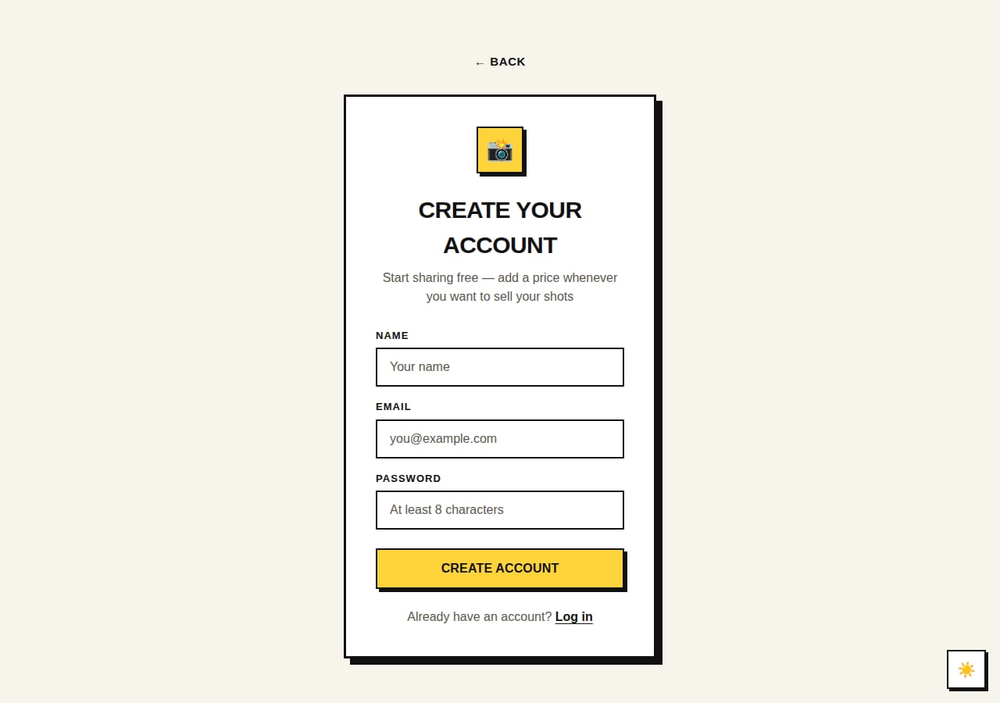
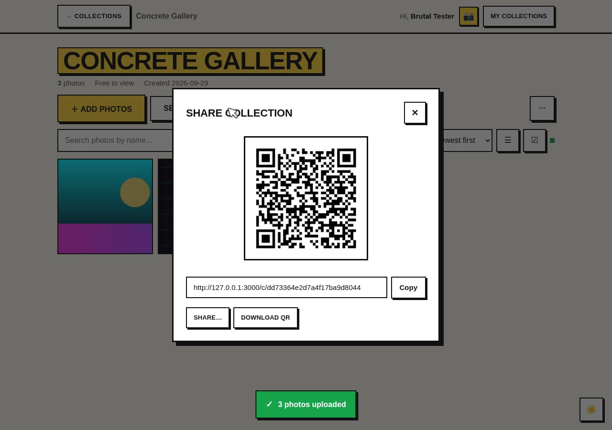
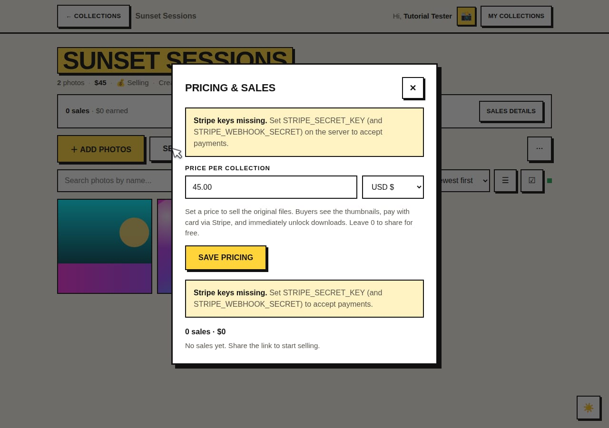
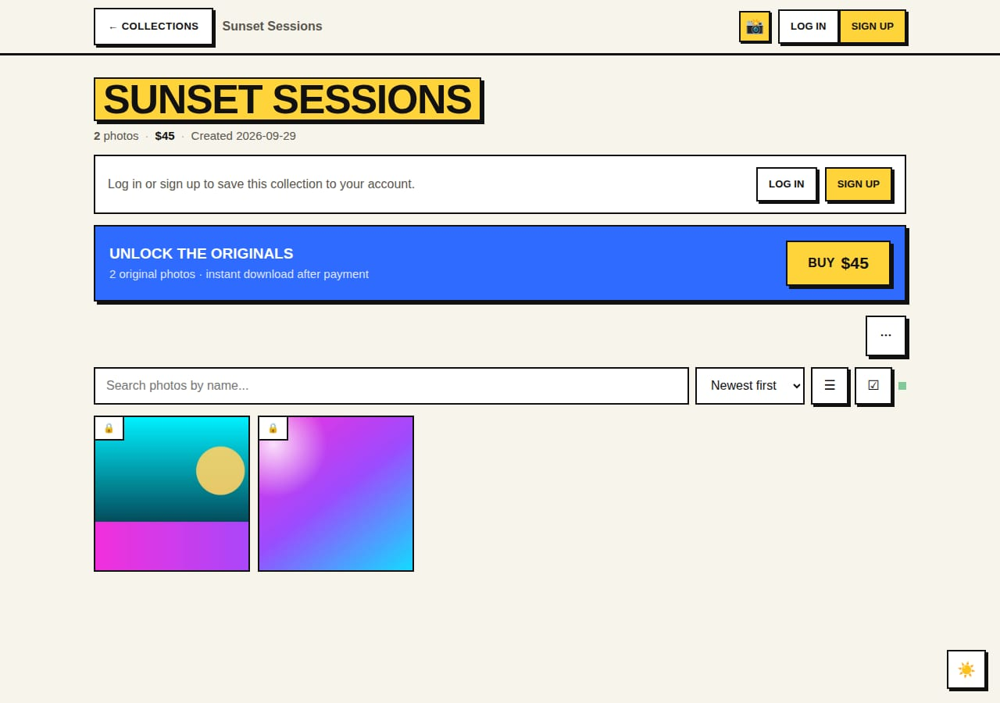
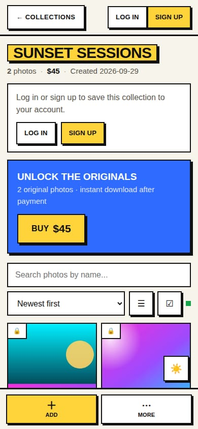

# Getting started

This guide takes you from zero to getting paid. It has two parts:

- **Part 0 — put it online** (once, if you are running your own instance)
- **Parts 1-6 — set up your account, share a collection and sell** (the everyday flow)

There is nothing to install for the people who look at your photos. They scan a QR
code and the gallery opens in their browser. No app, no account, no signup.

---

## Part 0 — Put it online (about 10 minutes)

If someone already gave you an account on their instance, skip to Part 1.

1. **Database and storage** — create a Supabase project, run `supabase/schema.sql`
   in the SQL editor, create a **private** bucket named `photos`. Full walkthrough:
   [SELF_HOSTING.md](SELF_HOSTING.md).
2. **Configure** — copy `server/.env.example` to `server/.env` and fill in
   `SUPABASE_URL` and `SUPABASE_SERVICE_ROLE_KEY`.
3. **Run it** — `docker compose up --build -d`, or `npm install && npm run server`.
4. **Put it behind HTTPS** — service workers, the camera and "Add to Home Screen"
   all require a secure context. Any reverse proxy or platform (Vercel, Fly.io,
   Render, Caddy, nginx) works. Set `PUBLIC_BASE_URL` to that address so QR codes
   and preview cards use the right links.
5. **Optional but recommended: Stripe** — add `STRIPE_SECRET_KEY` and
   `STRIPE_WEBHOOK_SECRET` so you can sell. See Part 4.

You can create collections without Stripe. Payments are only needed when you put a
price on something.

---

## Part 1 — Create your account

1. Open your instance in a browser and choose **Sign up**.
2. Fill in a name, email and password (at least 8 characters).

   

3. You land on **Your Collections**. That is the whole account setup — there is no
   email confirmation loop, no credit card, no company details.

### Put it on your phone

Both are optional and take seconds:

- **Install the web app (recommended).** On Android/desktop Chrome tap the
  **Install app** button that appears in the app; on iPhone use Share →
  **Add to Home Screen**. It opens full screen, works offline for the shell, and
  updates itself.
- **Android APK.** Download `take-the-shot-android.apk` from
  [Releases](https://github.com/Jayhub27/photo-sharing-app/releases) and open it.

---

## Part 2 — Create your first collection

1. From the home page, type a name in the **Collection name** field and press
   **Create**. Collections are just named groups — "Iceland Trip", "Anna & Tom",
   "Tuesday U15 match".
2. Open the collection and tap **＋ Add photos**. You get two pickers:
   - **Choose photos** — the normal photo library, multi-select
   - **Take photo** — opens the camera directly

   Photos are downscaled on your phone before they upload (max 2048px, JPEG),
   which makes uploads fast and reliable on mobile data. Originals are stored
   untouched on the server for buyers to download.
3. Prefer links? **More → Import from link** accepts direct image URLs, Google
   Drive file links and any page with an `og:image` tag.
4. Working with someone? **Manage members** invites them by email as a viewer or
   an editor. New photos appear for everyone within about 5 seconds.

---

## Part 3 — Share it

Open a collection and tap **Share** (desktop) or **Share** in the bottom bar
(mobile). You get a QR code, a link, the native share sheet, and a downloadable QR
image for print.



Anyone who scans the code opens the gallery in their phone browser. No app
install, no account, no "continue with Google".

---

## Part 4 — Get paid

### 4.1 One-time setup: connect Stripe

The person running the instance adds two values to `server/.env`:

```bash
STRIPE_SECRET_KEY=sk_...          # https://dashboard.stripe.com/apikeys
STRIPE_WEBHOOK_SECRET=whsec_...   # endpoint: /api/stripe/webhook
```

and points a webhook at `https://your-domain.com/api/stripe/webhook` for
`checkout.session.completed` and `checkout.session.async_payment_succeeded`.

> Start in **test mode**. Test keys and a test webhook secret work exactly the same
> way, and you can pay with the card `4242 4242 4242 4242`.

### 4.2 Put a price on a collection

Open the collection → **Sell** (desktop) or the price link → enter an amount,
for example `45.00` → **Save pricing**.



Leave the field empty to make the collection free again. Free collections still
show thumbnails to everyone they are shared with.

### 4.3 What buyers see

They open the link or scan the QR, see the thumbnails, and hit one button:



Stripe Checkout handles the card, Apple Pay and Google Pay. The moment the
webhook arrives, every original file unlocks for that buyer — single downloads and
ZIPs included. Nobody has to create an account to buy.

<div align="center">
  
</div>

### 4.4 Where the money goes

- **You run your own instance** → payments go into **your** Stripe account. Stripe
  pays out to your bank on your normal schedule. Take the shot never touches the
  money and takes 0%.
- **You run an instance for several photographers** → each photographer opens a
  collection they own → **Sell** → **Connect Stripe** and finishes Stripe's hosted
  onboarding. The account id lands in `users.stripe_account_id` and checkout
  transfers the money to them (`transfer_data.destination`). You can keep a
  platform cut by setting `STRIPE_APPLICATION_FEE_PERCENT=10`.
- Card processing fees are Stripe's and are charged on top of your price. There is
  no commission, no subscription and no minimum.

### 4.5 Receipts and refunds

Buyers get a Stripe receipt if you enable receipts in the Stripe dashboard
(Settings → Emails). Refunds are handled in Stripe; the buyer keeps or loses access
based on the purchase record, which you can inspect any time.

---

## Part 5 — After the sale

- **Sales dashboard.** Owners see sales count, gross revenue and buyer emails per
  collection (collection → **Sales details**).
- **Purchased state sticks.** A buyer revisits the same link later, or on another
  device, and their download access is still there.
- **Expiry interacts with sales.** If you schedule a collection to auto-delete, the
  dialog warns you that buyers lose access when it goes. Don't put an end date on
  something people paid for unless that is the deal.

---

## Part 6 — Privacy at a glance

Take the shot is built to be boring about data — in a good way.

- **Your photos stay on your storage.** The bucket is private; images are streamed
  through the server after an access check, never exposed as public URLs.
- **No analytics, no tracking pixels, no ads, no third-party scripts.** The app
  ships its own CSS, JS and fonts from your own origin.
- **No accounts for buyers.** Their email is only used by Stripe for the receipt.
- **You choose how long data lives.** Collections can auto-delete after 1 to 3650
  days, storage objects included.
- **What the server stores:** accounts (name, email, bcrypt password hash), photo
  files and metadata, session tokens, collection membership and purchase records.
  Nothing else.

What to tell your clients: *"The gallery lives on my own server. It isn't public,
it isn't indexed, and I can set it to delete itself after N days."*

---

## Troubleshooting

| Symptom | Fix |
| --- | --- |
| "Payments are not configured" on Buy | `STRIPE_SECRET_KEY` is missing on the server |
| Pricing saves but buyers never unlock | Webhook not configured or wrong `STRIPE_WEBHOOK_SECRET` |
| "Database setup needed" when selling | Run the `selling` section of `supabase/schema.sql` |
| QR opens but the gallery is empty | The collection is private (`More → Make private`); only members can view it |
| Upload fails on mobile data | Retry the failed photo — each file is uploaded separately and failures don't cancel the batch |
| Install button never appears | Browsers only offer it over HTTPS (or localhost) |

More depth: [SELF_HOSTING.md](SELF_HOSTING.md) for infrastructure,
[MOBILE.md](MOBILE.md) for the PWA and the Expo app.
